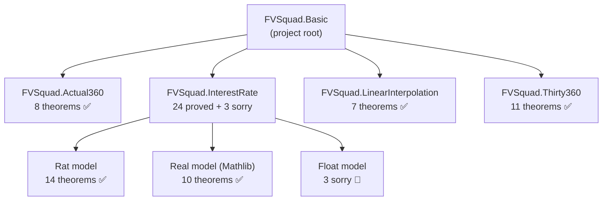
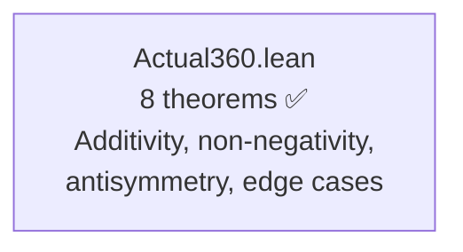
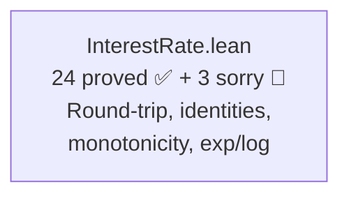
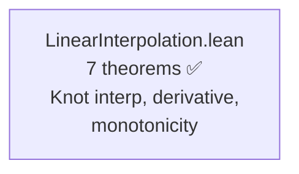
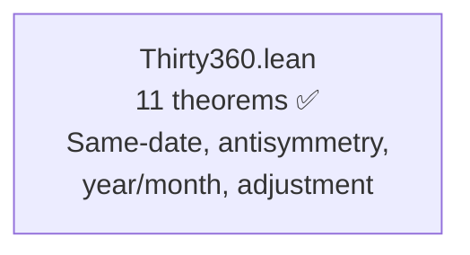
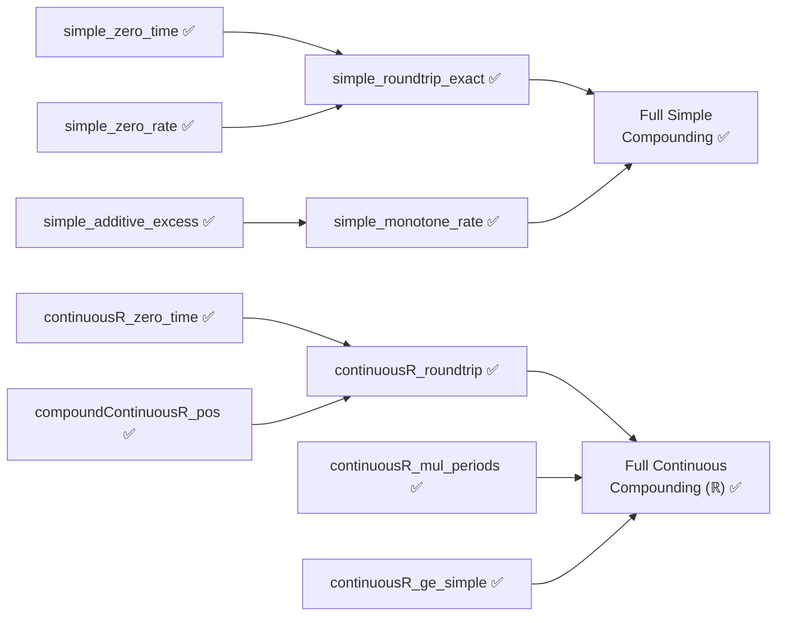
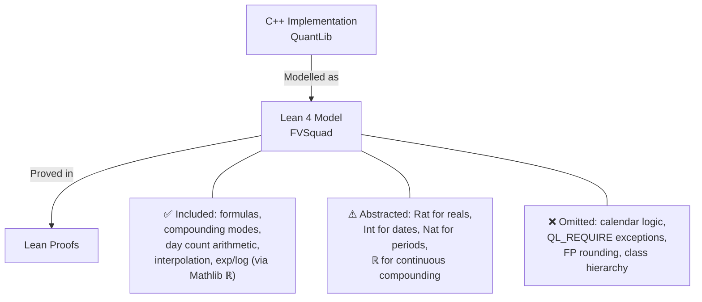

> 🔬 *Lean Squad — automated formal verification for `dsyme/QuantLib`.*

**Status**: 🔄 IN PROGRESS — 50 theorems proved, 5 Lean files, 3 `sorry`, Lean 4 + Mathlib.

## Last Updated
- **Date**: 2026-04-30 18:37 UTC
- **Commit**: `2301fd6b0`

---

## Executive Summary

Formal verification of QuantLib's quantitative finance primitives is well advanced using Lean 4 with Mathlib. Four targets are now verified: **Actual360** (8/8 theorems, fully proved with 2,920 correspondence tests), **InterestRate** (24/27 theorems across Rat/ℝ/Float models, 3 Float sorry remaining), **LinearInterpolation** (7/7 theorems, fully proved with 12 correspondence tests), and **Thirty360** (11/11 theorems, fully proved for the European convention). Total: **50 proved theorems** across 4 targets with 0 bugs found. The verification covers day counting, interest rate compounding, and interpolation — core building blocks of quantitative finance.

---

## Proof Architecture

The verification is organised into independent target modules, each modelling a specific QuantLib component. InterestRate uses a triple-model architecture: exact `Rat` for algebraic proofs, Mathlib `ℝ` for continuous compounding, and `Float` for computational verification.



---

## What Was Verified

### Actual360 — Day Counter (1 file, 8 theorems)

Models the Act/360 day counting convention from `ql/time/daycounters/actual360.hpp`. Uses exact integer arithmetic — no approximation needed.



**Key results**:
- `dayCount_additive`: `dayCount(d1,d2) + dayCount(d2,d3) = dayCount(d1,d3)` — the fundamental algebraic property
- `dayCount_antisymm`: `dayCount(d1,d2) = -dayCount(d2,d1)` — reversal symmetry
- `dayCount_includeLastDay_off_by_one`: proves the exact off-by-one when `includeLastDay=true`
- `dayCount_nonneg`, `dayCount_pos_includeLastDay`: non-negativity under ordering
- `dayCount_self`, `dayCount_self_includeLastDay`: zero/one at same date
- `yearFraction_eq_dayCount_div_360`: formula definition correctness

### InterestRate — Compounding Algebra (1 file, 24 proved + 3 sorry)

Models `InterestRate::compoundFactor` and `impliedRate` from `ql/interestrate.hpp/cpp`. Triple model: exact `Rat` for algebraic proofs, Mathlib `ℝ` for continuous compounding, `Float` for computational examples.



**Proved theorems over Rat** (14):
- `simple_roundtrip_exact`: `impliedSimpleQ(compoundSimpleQ(r, t), t) = r` when `t ≠ 0`
- `simple_zero_time`, `simple_zero_rate`: identity elements
- `compounded_zero_periods`, `compounded_zero_rate`: compounded identity elements
- `simple_additive_excess`: linearity of excess growth
- `simple_monotone_rate`: higher rate ⇒ higher compound factor
- `compounded_one_period`: reduction to `1 + r/n` for single period
- `simple_pos`: positivity under standard conditions
- `compounded_mul_periods`: `(1+r/n)^a · (1+r/n)^b = (1+r/n)^(a+b)`
- `simple_time_scaling`: excess return scales linearly with time
- `simple_monotone_time`: longer time ⇒ higher compound factor (r > 0)
- `compounded_monotone_periods`: more periods ⇒ higher compound factor
- `compounded_pos`: positivity of compounded factor

**Proved theorems over ℝ (Mathlib)** (10):
- `compoundContinuousR_pos`: `exp(r·t) > 0` via `Real.exp_pos`
- `continuousR_roundtrip`: `log(exp(r·t))/t = r` via `Real.log_exp`
- `continuousR_zero_time`, `continuousR_zero_rate`: identity elements via `Real.exp_zero`
- `continuousR_mul_periods`: `exp(r·(s+t)) = exp(r·s)·exp(r·t)` via `Real.exp_add`
- `continuousR_monotone_rate`: higher rate ⇒ higher compound factor
- `continuousR_monotone_time`: longer time ⇒ higher factor
- `continuousR_discount`: discount factor property
- `continuousR_gt_one`: `exp(r·t) > 1` when `r·t > 0`
- `continuousR_ge_simple`: continuous ≥ simple compounding

**Sorry-guarded** (3, require Float axioms):
- `compoundContinuous_pos`, `continuous_roundtrip`, `compounded_roundtrip`

### LinearInterpolation (1 file, 7 theorems)

Models `LinearInterpolation` from `ql/math/interpolations/linearinterpolation.hpp`. Pure rational arithmetic.



**Key results**:
- `second_derivative_zero`: piecewise linearity (second derivative vanishes)
- `knot_interpolation`: exact interpolation at knot points
- `derivative_eq_slope`: derivative equals finite difference slope
- `constant_slope`: constant data ⇒ zero slope
- `constant_value`: constant data ⇒ interpolated value matches
- `monotone_nonneg_slope`: monotone data ⇒ non-negative slope
- `antitone_nonpos_slope`: antitone data ⇒ non-positive slope

### Thirty360 — Day Counter, European Convention (1 file, 11 theorems)

Models the 30/360 European day counting convention from `ql/time/daycounters/thirty360.hpp`.



**Key results**:
- `same_date_zero`: zero day count for identical dates
- `yearfrac_eq_daycount_div_360`: formula definition
- `antisymmetry`: reversal symmetry
- `full_year`, `full_month`: canonical counts for full periods
- `adjust_idempotent`, `adjust_le_30`: day-31 adjustment properties
- `bounded_same_month`: bounded result for same-month dates
- `additivity_normal_days`: additivity for normal (≤30) days
- `day31_eq_day30`: day 31 treated as day 30
- `monotone_year`: year contribution monotonicity

---

## File Inventory

| File | Proved | Sorry | Phase | Key result |
|------|--------|-------|-------|------------|
| `Actual360.lean` | 8 | 0 | ✅ Fully proved | Additivity, antisymmetry, non-negativity |
| `InterestRate.lean` | 24 | 3 | 🔄 Partial (Float) | Round-trip, identities, monotonicity, exp/log |
| `LinearInterpolation.lean` | 7 | 0 | ✅ Fully proved | Knot interpolation, derivative, monotonicity |
| `Thirty360.lean` | 11 | 0 | ✅ Fully proved | Same-date, antisymmetry, adjustment, additivity |
| `Basic.lean` | 0 | 0 | — | Project root |
| **Total** | **50** | **3** | — | — |

---

## The Main Proof Chain

The simple compounding round-trip is the headline result for InterestRate:



The round-trip theorem states: for any rate `r` and time `t ≠ 0`,
```
impliedSimpleQ (compoundSimpleQ r t) t = r
```

---

## Modelling Choices and Known Limitations



| Category | What's covered | What's abstracted/omitted |
|----------|---------------|--------------------------|
| Actual360 | Exact integer day-count formula | Calendar date construction (leap years, months) |
| InterestRate (Simple) | Exact rational arithmetic, all algebraic properties | IEEE 754 rounding |
| InterestRate (Compounded) | Zero-rate and zero-period identities, monotonicity | Fractional exponents, n-th roots |
| InterestRate (Continuous) | Real-valued exp/log via Mathlib ℝ (10 theorems proved) | IEEE 754 rounding |
| LinearInterpolation | Exact rational piecewise-linear model | Floating-point, extrapolation behaviour |
| Thirty360 | European convention day adjustment, exact formula | Other 30/360 conventions (US, Italian, etc.) |
| General | Pure mathematical formulas | I/O, serialization, observer pattern, market data |

---

## Spec-to-Implementation Complexity

| Target | Spec lines | Impl lines | Ratio | Assessment |
|--------|-----------|------------|-------|------------|
| `Actual360` | ~35 (8 theorems + types) | ~65 (C++ header) | **High** | Spec captures full correctness with simple algebraic laws; impl has class hierarchy overhead |
| `InterestRate` | ~120 (27 theorems + types across 3 models) | ~360 (hpp + cpp) | **High** | Clean algebraic properties constrain a multi-mode implementation |
| `LinearInterpolation` | ~60 (7 theorems + types) | ~150 (hpp + template machinery) | **High** | Concise mathematical properties constrain complex template implementation |
| `Thirty360` | ~80 (11 theorems + types) | ~200 (hpp + cpp, multiple conventions) | **Medium-High** | Good ratio for European convention; full coverage requires all conventions |

---

## Findings

### Bugs Found

No implementation bugs found so far. All Actual360 properties match the C++ exactly, confirmed by both formal proof and ~2,920 correspondence test cases. InterestRate's algebraic laws hold over exact rationals, continuous compounding proved over Mathlib's ℝ, and LinearInterpolation confirmed by 12 test cases.

### Formulation Issues

The original InterestRate spec used `Float` throughout, making proofs impossible without Float-specific axioms. **Run 5 reformulated the model** to use exact `Rat` for provable properties. **Run 9 added Mathlib** and introduced a third layer using `ℝ` for transcendental functions, enabling continuous compounding proofs. This triple-model approach (Rat + ℝ + Float) is the recommended pattern for future targets.

### Interesting Structural Discoveries

- The `includeLastDay` flag breaks additivity in a precise way: `dayCount(d1,d2,T) + dayCount(d2,d3,T) = dayCount(d1,d3,T) + 1`. Proved formally — confirms the design is intentional.
- Simple compounding's excess over 1 is exactly additive in time: `(1+r(s+t))-1 = ((1+rs)-1) + ((1+rt)-1)`. This is the linearity property that makes simple interest "simple."
- Continuous compounding is provably ≥ simple compounding (`continuousR_ge_simple`), a well-known result now formally verified.
- Day-31 adjustment in Thirty360 European is idempotent (`adjust_idempotent`) — applying the rule twice is the same as once.

---

## Project Timeline

```mermaid
timeline
    title FV Project Development
    section Run 1 (2026-04-29)
        Research : 5 targets identified
        Informal Specs : Actual360 and InterestRate
    section Run 2 (2026-04-29)
        Lean Specs : Actual360 fully proved (8 theorems)
        Lean Specs : InterestRate specs (6 sorry)
    section Run 3 (2026-04-29)
        Correspondence : Actual360 tests (2920 cases)
        Report : Project report created
    section Run 4 (2026-04-29)
        Proofs : InterestRate 7 new proofs (Rat model)
    section Run 5-8 (2026-04-30)
        CI : lean-ci.yml created
        Paper : Conference paper draft
        Proofs : 4 more Rat proofs + critique
    section Run 9 (2026-04-30)
        Mathlib : Added Mathlib dependency
        Proofs : 5 Real-valued theorems (exp/log)
    section Run 10 (2026-04-30)
        Correspondence : Review updated for triple model
        Report : Updated to 24 proved theorems
    section Run 11-12 (2026-04-30)
        Proofs : 9 more InterestRate proofs (monotonicity)
        Spec : LinearInterpolation informal spec
    section Run 13 (2026-04-30)
        Spec : Thirty360 informal spec
    section Run 14-15 (2026-04-30)
        Lean : LinearInterpolation 7 theorems proved
        Lean : Thirty360 11 theorems proved
        Correspondence : LinearInterpolation 12 test cases
    section Run 16 (2026-04-30)
        Correspondence : Updated for Thirty360 + LinearInterpolation
        Proofs : 2 new Thirty360 theorems
    section Run 17 (2026-04-30)
        Report : Updated to 50 proved theorems
```



---

## Toolchain

- **Prover**: Lean 4 (stable via elan)
- **Libraries**: Mathlib (leanprover-community/mathlib4) — `Real.exp`, `Real.log`, algebra automation
- **CI**: `lean-ci.yml` with Mathlib caching via `actions/cache`
- **Build system**: Lake

| Tactic | Usage |
|--------|-------|
| `simp` | Definitional unfolding, simplification |
| `omega` | Integer arithmetic (Actual360, Thirty360 proofs) |
| `rfl` | Definitional equality |
| `rw` | Rewriting with lemmas (`Rat.add_comm`, `Rat.mul_div_cancel`, etc.) |
| `unfold` | Definition expansion |
| `exact` | Direct proof term application |
| `ring` | Ring arithmetic (rational algebra) |
| `linarith` | Linear arithmetic |
| `norm_num` | Numeric normalization |
| `induction` | Structural induction |
| `positivity` | Positivity goals |
