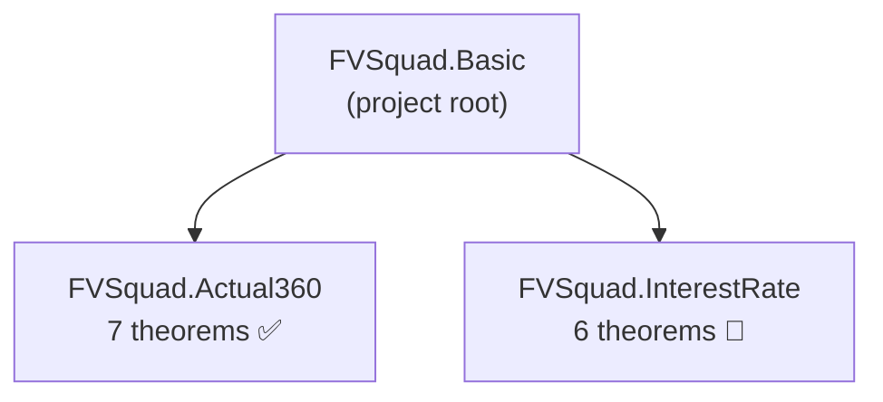
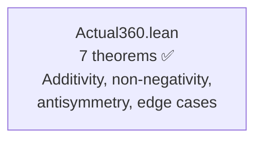
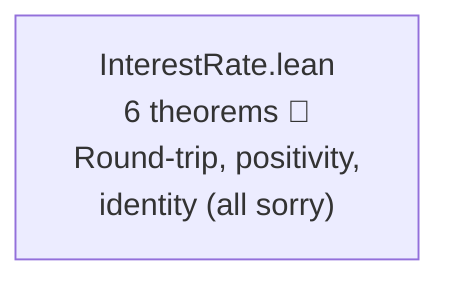
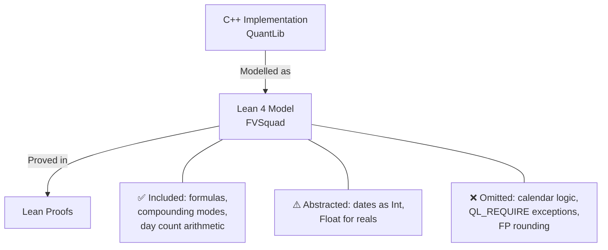
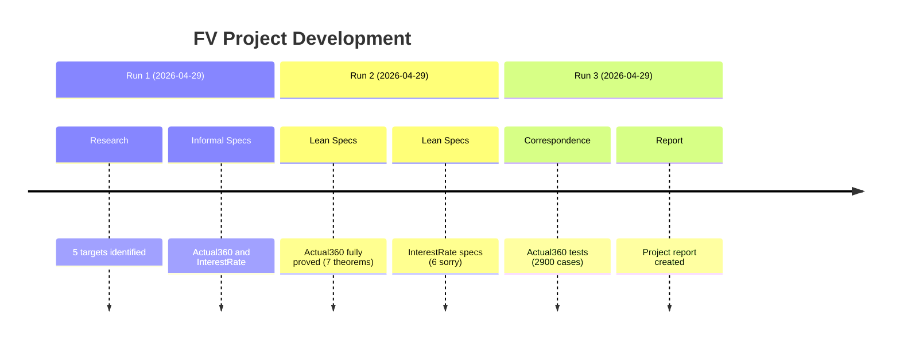

> 🔬 *Lean Squad — automated formal verification for `dsyme/QuantLib`.*

**Status**: 🔄 IN PROGRESS — 7 theorems proved, 3 Lean files, 6 `sorry`, Lean 4.30.0-rc2.

## Last Updated
- **Date**: 2026-04-29 20:30 UTC
- **Commit**: `07c6bfd98ddb`

---

## Executive Summary

Formal verification of QuantLib's quantitative finance primitives is underway using Lean 4. The **Actual360** day counter is fully verified with 7 proved theorems covering additivity, non-negativity, antisymmetry, and formula correctness — all proved via `simp` and `omega` with no `sorry` remaining. The **InterestRate** compounding module has 6 theorem statements covering round-trip, positivity, and identity properties, pending proofs (requires Mathlib). Correspondence testing confirms that the Actual360 Lean model exactly matches the C++ implementation across ~2,900 test cases.

---

## Proof Architecture

The verification is organised into independent target modules, each modelling a specific QuantLib component.

---

## What Was Verified

### Actual360 — Day Counter (1 file, 7 theorems)

Models the Act/360 day counting convention from `ql/time/daycounters/actual360.hpp`. Uses exact integer arithmetic — no approximation needed.

**Key results**:
- `dayCount_additive`: `dayCount(d1,d2) + dayCount(d2,d3) = dayCount(d1,d3)` — the fundamental algebraic property
- `dayCount_antisymm`: `dayCount(d1,d2) = -dayCount(d2,d1)` — reversal symmetry
- `dayCount_includeLastDay_off_by_one`: proves the exact off-by-one when `includeLastDay=true`
- `dayCount_nonneg`, `dayCount_pos_includeLastDay`: non-negativity under ordering
- `dayCount_self`, `dayCount_self_includeLastDay`: zero/one at same date
- `yearFraction_eq_dayCount_div_360`: formula definition correctness

### InterestRate — Compounding Algebra (1 file, 6 sorry-guarded theorems)

Models `InterestRate::compoundFactor` and `impliedRate` from `ql/interestrate.hpp/cpp`. Uses `Float` as a stand-in for reals.

**Stated properties** (proofs pending):
- `simple_roundtrip`, `continuous_roundtrip`, `compounded_roundtrip`: implied rate inverts compound factor
- `compoundContinuous_pos`: `e^(r·t) > 0` for all inputs
- `compoundFactor_zero_time`: compound factor = 1 at t=0
- `compoundFactor_zero_rate`: compound factor = 1 at r=0

---

## File Inventory

| File | Theorems | Phase | Key result |
|------|----------|-------|------------|
| `Actual360.lean` | 7 | ✅ Fully proved | Additivity, antisymmetry, non-negativity |
| `InterestRate.lean` | 6 | 🔄 Sorry-guarded | Round-trip, positivity, identity |
| `Basic.lean` | 0 | — | Project root |
| **Total** | **13** | — | **6 sorry** |

---

## Modelling Choices and Known Limitations

| Category | What's covered | What's abstracted/omitted |
|----------|---------------|--------------------------|
| Actual360 | Exact integer day-count formula | Calendar date construction (leap years, months) |
| InterestRate | All 5 compounding modes, compound factor, implied rate | IEEE 754 edge cases (NaN, Inf), `QL_REQUIRE` error handling |
| General | Pure mathematical formulas | I/O, serialization, observer pattern, market data |

---

## Spec-to-Implementation Complexity

| Target | Spec lines | Impl lines | Ratio | Assessment |
|--------|-----------|------------|-------|------------|
| `Actual360` | ~30 (7 theorems + types) | ~65 (C++ header) | **High** | Spec captures full correctness with simple algebraic laws; impl has class hierarchy overhead |
| `InterestRate` | ~60 (6 theorems + types) | ~360 (hpp + cpp) | **High** | Spec states algebraic round-trip laws; impl has 5-way switch, frequency handling, error paths |

---

## Findings

### Bugs Found

No implementation bugs found so far. All Actual360 properties match the C++ exactly, confirmed by both formal proof and ~2,900 correspondence test cases.

### Formulation Issues

None. The Actual360 spec was straightforward. InterestRate theorems are well-formulated but require Mathlib's `Real` type for proper proofs (Float lacks algebraic reasoning support).

### Interesting Structural Discoveries

- The `includeLastDay` flag breaks additivity in a precise way: `dayCount(d1,d2,T) + dayCount(d2,d3,T) = dayCount(d1,d3,T) + 1`. This was proved formally and confirms the design is intentional, not a bug.

---

## Project Timeline

---

## Toolchain

- **Prover**: Lean 4 v4.30.0-rc2
- **Libraries**: stdlib only (Mathlib blocked by network firewall in CI)
- **CI**: Not yet configured (Task 9 pending)
- **Build system**: Lake

| Tactic | Usage |
|--------|-------|
| `simp` | Definitional unfolding |
| `omega` | Integer arithmetic (all Actual360 proofs) |
| `rfl` | Definitional equality |
