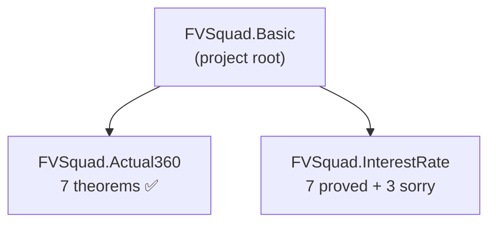
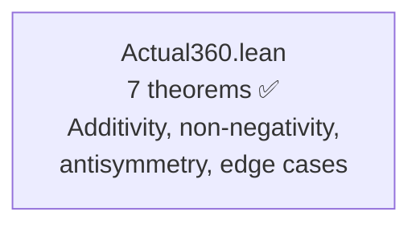
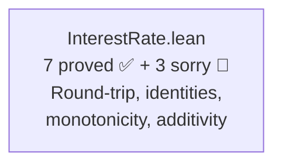
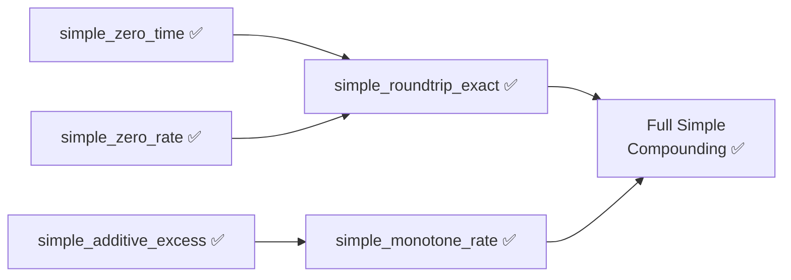
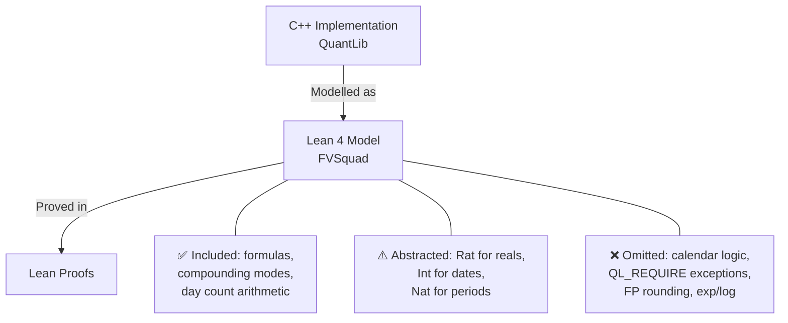
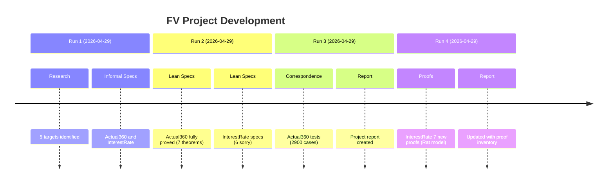

> 🔬 *Lean Squad — automated formal verification for `dsyme/QuantLib`.*

**Status**: 🔄 IN PROGRESS — 14 theorems proved, 3 Lean files, 3 `sorry`, Lean 4.30.0-rc2.

## Last Updated
- **Date**: 2026-04-29 20:42 UTC
- **Commit**: `a21e6d97e`

---

## Executive Summary

Formal verification of QuantLib's quantitative finance primitives is progressing well using Lean 4. The **Actual360** day counter is fully verified with 7 proved theorems and ~2,900 correspondence tests confirming exact match with C++. The **InterestRate** compounding module now has 7 fully proved theorems over exact rationals (`Rat`) covering round-trip inversion, zero-time/zero-rate identities, additive excess, and monotonicity — plus 3 sorry-guarded properties that require transcendental functions (continuous compounding) or fractional exponents (compounded round-trip). Total: 14 proved theorems across 2 targets.

---

## Proof Architecture

The verification is organised into independent target modules, each modelling a specific QuantLib component. InterestRate now has a dual-model architecture: an exact `Rat` model for proofs and a `Float` model for computational verification.



---

## What Was Verified

### Actual360 — Day Counter (1 file, 7 theorems)

Models the Act/360 day counting convention from `ql/time/daycounters/actual360.hpp`. Uses exact integer arithmetic — no approximation needed.



**Key results**:
- `dayCount_additive`: `dayCount(d1,d2) + dayCount(d2,d3) = dayCount(d1,d3)` — the fundamental algebraic property
- `dayCount_antisymm`: `dayCount(d1,d2) = -dayCount(d2,d1)` — reversal symmetry
- `dayCount_includeLastDay_off_by_one`: proves the exact off-by-one when `includeLastDay=true`
- `dayCount_nonneg`, `dayCount_pos_includeLastDay`: non-negativity under ordering
- `dayCount_self`, `dayCount_self_includeLastDay`: zero/one at same date
- `yearFraction_eq_dayCount_div_360`: formula definition correctness

### InterestRate — Compounding Algebra (1 file, 7 proved + 3 sorry)

Models `InterestRate::compoundFactor` and `impliedRate` from `ql/interestrate.hpp/cpp`. Dual model: exact `Rat` for provable properties, `Float` for computational examples.



**Proved theorems** (over exact `Rat`):
- `simple_roundtrip_exact`: `impliedSimpleQ(compoundSimpleQ(r, t), t) = r` when `t ≠ 0` — the key round-trip inversion
- `simple_zero_time`: `compoundSimpleQ(r, 0) = 1` — identity at zero time
- `simple_zero_rate`: `compoundSimpleQ(0, t) = 1` — identity at zero rate
- `compounded_zero_periods`: `(1 + r/n)^0 = 1` — identity for compounded at zero periods
- `compounded_zero_rate`: `(1 + 0/n)^periods = 1` — identity for zero rate compounded
- `simple_additive_excess`: linearity of excess growth: `f(r,s+t) - 1 = (f(r,s)-1) + (f(r,t)-1)`
- `simple_monotone_rate`: higher rate ⇒ higher compound factor for `t ≥ 0`

**Sorry-guarded** (require Mathlib or transcendental functions):
- `compoundContinuous_pos`: `e^(r·t) > 0` — needs `Float.exp_pos` or `Real.exp_pos`
- `continuous_roundtrip`: `ln(e^(r·t))/t = r` — needs `Real.log_exp`
- `compounded_roundtrip`: `((1+r/n)^(nt))^(1/(nt)) = r` — needs fractional exponents

---

## File Inventory

| File | Proved | Sorry | Phase | Key result |
|------|--------|-------|-------|------------|
| `Actual360.lean` | 7 | 0 | ✅ Fully proved | Additivity, antisymmetry, non-negativity |
| `InterestRate.lean` | 7 | 3 | 🔄 Partial | Round-trip, identities, monotonicity |
| `Basic.lean` | 0 | 0 | — | Project root |
| **Total** | **14** | **3** | — | — |

---

## The Main Proof Chain

The simple compounding round-trip is the headline result for InterestRate:



The round-trip theorem states: for any rate `r` and time `t ≠ 0`,
```
impliedSimpleQ (compoundSimpleQ r t) t = r
```

---

## Modelling Choices and Known Limitations



| Category | What's covered | What's abstracted/omitted |
|----------|---------------|--------------------------|
| Actual360 | Exact integer day-count formula | Calendar date construction (leap years, months) |
| InterestRate (Simple) | Exact rational arithmetic, all algebraic properties | IEEE 754 rounding |
| InterestRate (Compounded) | Zero-rate and zero-period identities | Fractional exponents, n-th roots |
| InterestRate (Continuous) | Float computational model | exp/log proofs (needs Mathlib `Real`) |
| General | Pure mathematical formulas | I/O, serialization, observer pattern, market data |

---

## Spec-to-Implementation Complexity

| Target | Spec lines | Impl lines | Ratio | Assessment |
|--------|-----------|------------|-------|------------|
| `Actual360` | ~30 (7 theorems + types) | ~65 (C++ header) | **High** | Spec captures full correctness with simple algebraic laws; impl has class hierarchy overhead |
| `InterestRate` | ~80 (10 theorems + types) | ~360 (hpp + cpp) | **High** | Spec states algebraic round-trip laws and identities; impl has 5-way switch, frequency handling, error paths |

---

## Findings

### Bugs Found

No implementation bugs found so far. All Actual360 properties match the C++ exactly, confirmed by both formal proof and ~2,900 correspondence test cases. InterestRate's algebraic laws hold over exact rationals.

### Formulation Issues

The original InterestRate spec used `Float` throughout, making proofs impossible without Mathlib or Float-specific axioms. **Run 5 reformulated the model** to use exact `Rat` for provable properties, enabling 7 new proofs while keeping `Float` for computational verification. This dual-model approach is the recommended pattern for future targets.

### Interesting Structural Discoveries

- The `includeLastDay` flag breaks additivity in a precise way: `dayCount(d1,d2,T) + dayCount(d2,d3,T) = dayCount(d1,d3,T) + 1`. This was proved formally and confirms the design is intentional, not a bug.
- Simple compounding's excess over 1 is exactly additive in time: `(1+r(s+t))-1 = ((1+rs)-1) + ((1+rt)-1)`. This is the linearity property that makes simple interest "simple."

---

## Project Timeline



---

## Toolchain

- **Prover**: Lean 4 v4.30.0-rc2
- **Libraries**: stdlib only (Mathlib blocked by network firewall in CI)
- **CI**: Not yet configured (Task 9 pending)
- **Build system**: Lake

| Tactic | Usage |
|--------|-------|
| `simp` | Definitional unfolding, simplification |
| `omega` | Integer arithmetic (all Actual360 proofs) |
| `rfl` | Definitional equality |
| `rw` | Rewriting with lemmas (`Rat.add_comm`, `Rat.mul_div_cancel`, etc.) |
| `unfold` | Definition expansion |
| `exact` | Direct proof term application |
| `induction` | Structural induction (e.g., `rat_one_pow`) |
